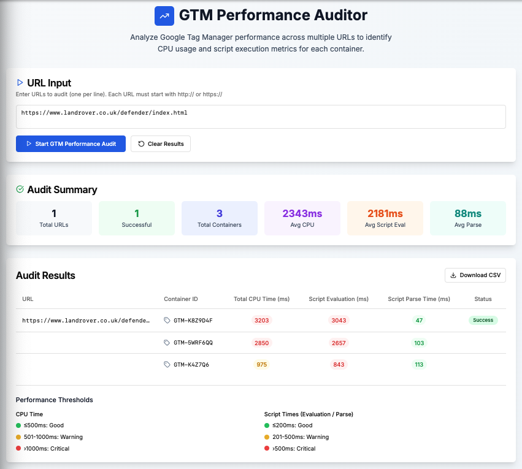

# GTM Site-Speed Auditor

A **Next.js 13 + Tailwind** web app that performs Google Tag Manager (GTM) performance audits for a list of URLs **using Lighthouse in headless Chrome**. The UI colour-codes metrics, exports results to CSV, and provides aggregated summaries.



---

## Table of Contents
1. Features
2. Tech Stack
3. Quick Start
4. Project Structure
5. Configuration
6. Contributing
7. For AI Agents & CI
8. License

---

## 1  Features
• Paste multiple URLs; audits run sequentially with progress bar & ETA  
• **Per-container GTM metrics** – one row per container ID (e.g. `GTM-XXXX`)  
• Runs a real Lighthouse audit in headless Chrome for each URL  
• **Detailed server-side logging** – each API request is tagged with a UUID; logs include timings for audit and each Lighthouse run  
• Good / Warning / Critical thresholds with legend  
• CSV export, per-container summaries, and changelog dashboard  
• Fully typed (TypeScript) and accessible (Radix + shadcn/ui)

---

## 2  Tech Stack
| Layer            | Library / Tool                        |
|------------------|---------------------------------------|
| Front-end UI     | React 18 / Next.js 13 (App Router)     |
| Styling          | Tailwind CSS, shadcn/ui, Radix UI      |
| Icons            | lucide-react                           |
| State & Forms    | React Hook Form, Zod (optional)        |
| API              | Next.js Route Handlers (`app/api/*`) + Lighthouse + chrome-launcher |
| Utilities        | clsx + tailwind-merge, date-fns        |
| Logging          | Console (structured) + uuid            |
| Tooling          | ESLint, Prettier, TypeScript           |

---

## 3  Quick Start

### Prerequisites
* **Node.js ≥ 20**
* **Google Chrome (stable) installed locally** – `chrome-launcher` will auto-detect the binary.


```bash
# 1. Install dependencies
npm ci          # or pnpm install / yarn

# 2. Run in dev mode
npm run dev     # http://localhost:3000
#   If audits fail, make sure Chrome is installed and not blocked by sandbox flags.

# 3. Production build & start
npm run build
npm start

# 4. Run with Docker (optional)
docker compose up --build   # http://localhost:3000
#   The image installs Google Chrome and sets CHROME_PATH automatically.
```

---

## 4  Project Structure
```
gtm-site-speed/
├─ app/                    # Next.js App Router directory
│  ├─ api/
│  │   └─ audit/route.ts   # Lighthouse audit API route
│  ├─ globals.css          # Tailwind base styles
│  ├─ layout.tsx           # Root layout (theme provider etc.)
│  └─ page.tsx             # GTMPerformanceAuditor UI
│
├─ components/             # Reusable UI primitives (shadcn + Radix)
│  └─ ui/                  # shadcn/ui components (47 components)
├─ hooks/                  # Custom React hooks (e.g. use-toast)
├─ lib/                    # Utility helpers (e.g. cn())
├─ docs/                   # Documentation assets (e.g. screenshots)
├─ rsc/                    # Internal notes / improvement ideas
│
├─ .bolt/                  # Bolt configuration
├─ .dockerignore           # Docker ignore patterns
├─ .eslintrc.json          # ESLint configuration
├─ .gitignore              # Git ignore patterns
├─ components.json         # shadcn/ui component configuration
├─ Dockerfile              # Docker container configuration
├─ dockerissues.md         # Docker troubleshooting guide
├─ error-log.md            # Error troubleshooting documentation
├─ next-env.d.ts           # Next.js TypeScript definitions
├─ next.config.js          # Next.js configuration
├─ package.json            # Dependencies & scripts
├─ package-lock.json       # Locked dependency versions
├─ postcss.config.js       # PostCSS configuration
├─ tailwind.config.ts      # Tailwind theme configuration
├─ tsconfig.json           # TypeScript compiler options
└─ README.md               # This file
```

---

## 5  Configuration

| Setting | File | Description |
|---------|------|-------------|
| Performance thresholds | `app/page.tsx` → `getPerformanceStatus()` | Tweak warning / critical cut-offs |
| Lighthouse flags | `app/api/audit/route.ts` | Defaults are tuned for Docker/Cloud Run (`--headless`, `--disable-gpu`, `--no-sandbox`, `--disable-setuid-sandbox`, `--disable-dev-shm-usage`, `--remote-debugging-address=0.0.0.0`).  If Chrome still fails to launch, double-check these flags. |
| Tailwind theme colours | `tailwind.config.ts` | Uses CSS variables for easy theming |
| Environment variables | `.env.local` (none required locally).  The Dockerfile already sets `CHROME_PATH=/usr/bin/google-chrome-stable`. |

---

## 6  Contributing

1. **Branch naming**  
   `feat/feature-name`, `fix/bug-name`, `chore/task-name`

2. **Coding style**  
   • Run `npm run lint` and fix all issues.  
   • Keep components small & typed.  
   • Prefer utility-first Tailwind classes; use `cn()` to merge.

3. **Commit messages (Conventional Commits)**
```
feat: add CSV export button
fix(api): handle invalid URL error
```

4. **Pull Request checklist**
- [ ] Lint passes (`npm run lint`)
- [ ] App builds (`npm run build`)
- [ ] Added/updated tests if needed
- [ ] Updated docs / README if behaviour changes

5. **Good first issues**
   • Replace synthetic API with real Lighthouse CI call  
   • Add dark-mode toggle in `layout.tsx`  
   • Write unit tests for `calculateSummary()`

---

## 7  Troubleshooting
Common issues and fixes are documented in [`error-log.md`](./error-log.md).

---

## 8  For AI Agents & CI

Automated tools can safely contribute by running:

```bash
npm run lint          # ESLint + TypeScript
npm test              # Jest (if/when added)
npm run build         # Build verification
```

Rules:
* **Do not** commit generated `.next/` files.  
* Preserve formatting (`prettier --write .`).  
* Touch only necessary files; keep PRs focused.

---

## 9  Recent Changes

### 2025-08-09
- **Docker fixes** – Updated `CHROME_FLAGS` to include `--disable-gpu`, `--disable-setuid-sandbox`, and `--remote-debugging-address=0.0.0.0`, solving `Failed to fetch browser WebSocket URL / ECONNREFUSED` when running in containers.
- **Health-check & logging** – `audit/route.ts` now logs the Chrome port and validates the DevTools `/json/version` endpoint, providing faster failure detection.
- **Type fix** – Removed unsupported `host` option from `chrome-launcher` call.
- **Docs** – Added Docker quick-start instructions and expanded configuration notes.

### 2025-08-03

### API & Backend
- **Structured logging added** – `audit/route.ts` now generates per-request UUIDs and logs start/end times, per-run durations, and averaged metrics.
- **Per-container metrics** – `extractMetrics` now returns an array of `gtmMetrics`, one entry per GTM container, instead of a single aggregate.
- **Removed `blockingTime`** – dropped because Lighthouse does not expose per-script blocking time; thresholds updated accordingly.
- **Legacy code purged** – deleted duplicate `extractMetrics`, `auditURL`, and extra `POST` handler that broke the build.
- **Chrome flags consolidated** – `CHROME_FLAGS` covers serverless-safe launch args.
- **Type-safety improvements** – simplified `mean()` and removed down-level iteration by switching to `Map.forEach()`.

### Front-end
- **UI rewritten** – results table shows one row per container with CPU, Script Eval, and Script Parse columns.
- **CSV & summary updated** – now include `containerId` and per-container averages.
- **Duplicate component removed** – eliminated old aggregate implementation.

### Docs & Misc
- README updated to reflect per-container metrics.
- Fixed TypeScript compiler error related to `Map` iteration.

---

## 10  License
MIT © 2025 Rajeev Gill
